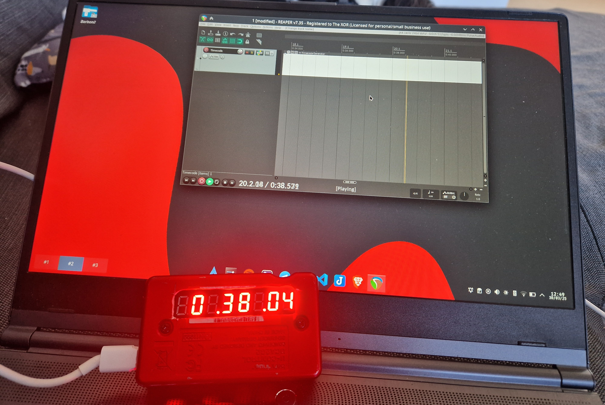

# MTC-Display
Arduino MIDI MTC Display

Here in all its beauty, with a professional grade architectonical beauty 

**Dependencies:

Arduino library [DigitLedDisplayEx](https://github.com/The-XOR/DigitLedDisplay)
